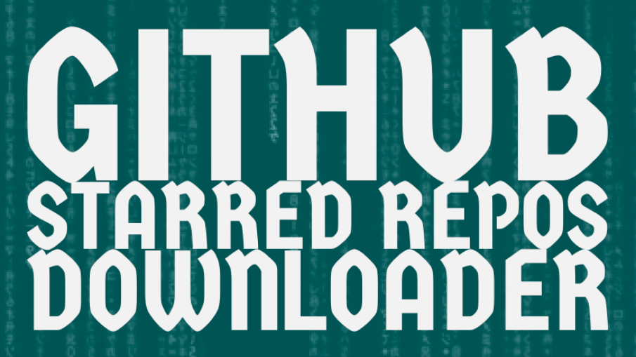
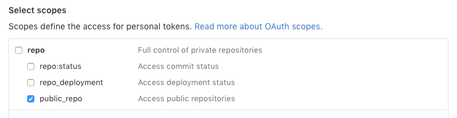

<p align="center">



<p align="center">
**gsrd** downloads your public starred repos.<br />Just in case you want to keep a backup of them from time to time.
<p>

<p>

<hr />

## Configuration

### Getting your credential
In order to keep your privacy, create your [personal token on Github](https://github.com/settings/tokens). You just need to select the option `public_repo` as shown below:



## Installation

```ruby
$ gem install gsrd
```

## Run
Run the code passing your access token as argument

<pre>
$ gsrd "<b>put</b>your<b>forty</b>character<b>generated</b>string<b>here</b>"
</pre>


## Requirement

* [wget](https://www.gnu.org/software/wget/)

## Information and Contact

Developed by [@LeonardoCardoso](https://github.com/LeonardoCardoso). 

Contact me either by Twitter [@leocardz](https://twitter.com/leocardz) or emailing me to [contact@leocardz.com](mailto:contact@leocardz.com).

## License

    The MIT License (MIT)

	Copyright (c) 2016 Leonardo Cardoso
	
	Permission is hereby granted, free of charge, to any person obtaining a copy
	of this software and associated documentation files (the "Software"), to deal
	in the Software without restriction, including without limitation the rights
	to use, copy, modify, merge, publish, distribute, sublicense, and/or sell
	copies of the Software, and to permit persons to whom the Software is
	furnished to do so, subject to the following conditions:
	
	The above copyright notice and this permission notice shall be included in all
	copies or substantial portions of the Software.
	
	THE SOFTWARE IS PROVIDED "AS IS", WITHOUT WARRANTY OF ANY KIND, EXPRESS OR
	IMPLIED, INCLUDING BUT NOT LIMITED TO THE WARRANTIES OF MERCHANTABILITY,
	FITNESS FOR A PARTICULAR PURPOSE AND NONINFRINGEMENT. IN NO EVENT SHALL THE
	AUTHORS OR COPYRIGHT HOLDERS BE LIABLE FOR ANY CLAIM, DAMAGES OR OTHER
	LIABILITY, WHETHER IN AN ACTION OF CONTRACT, TORT OR OTHERWISE, ARISING FROM,
	OUT OF OR IN CONNECTION WITH THE SOFTWARE OR THE USE OR OTHER DEALINGS IN THE
	SOFTWARE.
